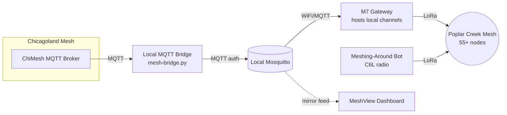

# Architecture: Poplar Creek Mesh Bridge

This document covers how the Poplar Creek Meshtastic network connects to Chicagoland Mesh, how that connection stays reliable, and what runs on top of it, a community bot and a public dashboard. Written for review, feedback and criticism welcome.

## Overview

Chicagoland Mesh enforces a zero-hop policy on its shared MQTT broker: messages coming in from MQTT reach the directly connected gateway node and go no further into that node's local LoRa mesh. That protects shared infrastructure from flooding, but it also means a local mesh can send to the wider community and never receive anything back once it's cut off from the internet in the usual ways.

The system described here works around that by running a private, self-hosted broker as an intermediate hop. It subscribes upstream to Chicagoland Mesh like any ordinary client, and separately controls downlink into the local mesh on its own terms. Four pieces make up the whole thing:

## The local MQTT bridge

This is the actual engineering behind the whole setup. A Python bridge script, `mesh-bridge.py`, runs as a systemd service on a dedicated LXC and connects upstream to Chicagoland Mesh's broker as a standard client. Downstream, it feeds a local Mosquitto instance with authentication enabled, which the M7 gateway connects to over WiFi.

The zero-hop restriction lives in Chicagoland Mesh's broker software, not in the Meshtastic firmware itself. Once a message reaches the local Mosquitto instance, nothing about the protobuf payload has been altered, hop_limit included, so the M7 forwards it onto LoRa exactly as if it had arrived over the air. That's the entire workaround: the zero-hop policy only ever applies to the hop between Chicagoland Mesh and this bridge, not to what happens after.

A few implementation details worth documenting since they came from real failures, not upfront design:

- **Deduplication** uses an MD5 hash FIFO cache capped at 1000 entries, needed once it became clear the same message could arrive from more than one path.
- **Watchdog** fires after 300 seconds of silence. That threshold came from watching 76,192 real events over five days, the longest naturally occurring quiet gap in that sample was 2 minutes 15 seconds, so five minutes gives real margin without false triggers. Recovery is a disconnect, a one second pause, then reconnect, which forces resubscription.
- **Subscription happens inside the on_connect callback**, not just once at startup, so it re-fires correctly on every reconnect rather than only the first one.
- **Keepalive timeouts freeze paho-mqtt** rather than raising a clean error. The fix is a deliberate sys.exit(1) inside on_disconnect, letting systemd's own restart policy recover the process rather than trying to recover in-process.
- **Startup retry loop** wraps the initial connection in a retry every 30 seconds if the upstream broker isn't reachable yet, so a reboot during an upstream outage doesn't crash-loop.
- Uses the paho-mqtt VERSION2 callback API, which changes the on_connect signature to include a reason_code and properties argument.

End-to-end validation: a message originating on Chicagoland Mesh reached a T1 tracker over LoRa with no MQTT configuration on the T1 at all, full chain confirmed as broker to bridge to local Mosquitto to gateway to LoRa to endpoint. Node updates from Chicagoland Mesh propagate the same way. A forced disconnect test recovered automatically in 4 minutes 4 seconds.

## M7 gateway and router

The M7, from Elecrow, hosts every local channel and bridges to the local Mosquitto broker over WiFi. This role originally ran on a repurposed M5Stack C6L, moved to the M7 in mid-September once the C6L's reliability made it a poor fit for anything the mesh depended on continuously.

## Meshing-Around bot

The C6L, freed up by the M7 taking over gateway duty, now runs [Meshing-Around](https://github.com/SpudGunMan/meshing-around), a command-driven bot answering requests from the mesh. It's deployed as a systemd service, config and behavior covered separately in this repo's bot guide.

Two deliberate restrictions shape how it behaves: replies always go out as a direct message, never posted back to the channel they came from, and the bot only responds on private local channels plus DMs, not the public default channel. Both decisions trace back to the same thing, this mesh runs on a shared public channel and the community shouldn't be exposed to bot chatter showing up where they're already talking. Automatic new-node greetings are disabled for the same reason.

Worth documenting since it shaped the current setup: the C6L previously had a chronic self-reboot roughly every ten hours, confirmed through serial capture as a genuine firmware exception tied to load and memory pressure, not power or thermal, with over 200 reboots logged before it was tracked down. Changing the node's role from client to client mute, and switching its connection from WiFi to direct USB, resolved it. No reboots since.

## MeshView reporting

[MeshView](https://github.com/pablorevilla-meshtastic/meshview) runs as a public dashboard, fed by a separate MQTT connection mirroring Chicagoland Mesh's own instance. This is a distinct feed from the emergency bridge described above, not the same pipe, MeshView's purpose is visualization and historical stats, not message delivery. It's a third-party codebase maintained by the BayMesh team, not something built here, though active use of it has already surfaced at least one upstream bug in its daily packet history query.

## Known limitations

- A five-node gap along the Route 59 corridor currently separates this mesh from a similarly built-out group near Naperville
- Meshtastic's Range Test mode floods local chat with sequence messages when anyone runs it nearby, no fix in place
- The firmware's relay node role was removed in a recent release cycle, affecting any planning that assumed it would stay available

## Next steps

Coordinating with Chicagoland Mesh directly on suburban expansion is the near-term goal, along with closing the Route 59 gap through word of mouth outreach to homelab-adjacent contacts in the Aurora area.
