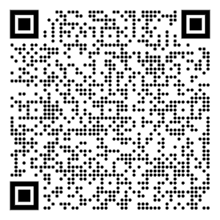
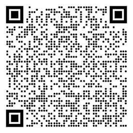
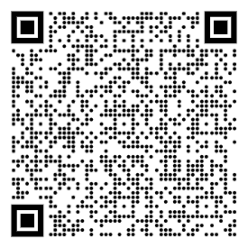

# NW Suburbs Channel Lineup

Meshtastic channels covering the Poplar Creek / Route 59 corridor mesh area. I have been attemping to help the folks in the suburbs to connected our fragmented mesh back to the Chicago Mesh network. 

In addtion to the information here for the suburubs you can head over to https://chicagolandmesh.org/

## How to join

Scan a channel's QR code, or import its URL directly: **Meshtastic app → Channels → Import**.

## Channels

### LongFast (public default)
- **Purpose:** Public default channel. Monitored, but replies from the mesh bot go out as a DM only, never posted back to the channel.
- **Modem preset:** LongFast
- **PSK:** Default (public)
- **Import:** No import needed, every Meshtastic device ships with this channel.

### PoplarCreek
- **Purpose:** Channel is for those that enjoy the Poplar Creek Forest Preserve in the NW Suburbs.
- **Channel Name:** PoplarCreek
- **Import URL:**
 https://meshtastic.org/e/?add=true#CjcSIEAyRZlLz5PpoX9Tk7Xy3Hl7wlrQ3suNfMU0wlEB14pJGgtQb3BsYXJDcmVlaygBMAE6AggNEhgIARj6ASALKAU4AUAHSAFQHmABaAHIBgE
- **Import Barcode:**
 

### Chicago NW Suburbs
- **Purpose:** Channel for the NW Suburbs of Chicago.
- **Channel Name:** ChiNWburbs
- **Import URL:**
  https://meshtastic.org/e/?add=true#CjYSIAhrLgLTevl7Xzdspp5-caG6ibGdMJ_R7W9KDutnsyZYGgpDaGlOV2J1cmJzKAEwAToCCA0SGAgBGPoBIAsoBTgBQAdIAVAeYAFoAcgGAQ
- **Import Barcode:**
 

### JustTalk
- **Purpose:** General talk channel to offload the default LongFast channel, planned for suburb use but everyone is welcome
- **Channel Name:** JustTalk
- **Import URL:**
  https://meshtastic.org/e/?add=true#CjASIIU5Dv5HHGAURGO5dwtiEC1-dpTeQpw-c1sRojlEU-iXGghKdXN0VGFsaygBMAESGAgBGPoBIAsoBTgBQAdIAVAeYAFoAcgGAQ
- **Import Barcode:**
 

<!-- duplicate the block above for each additional private channel -->

---

*Maintained by [RonV42](https://github.com/RonV42). Questions: DM the mesh bot, or open an issue on this repo.*
